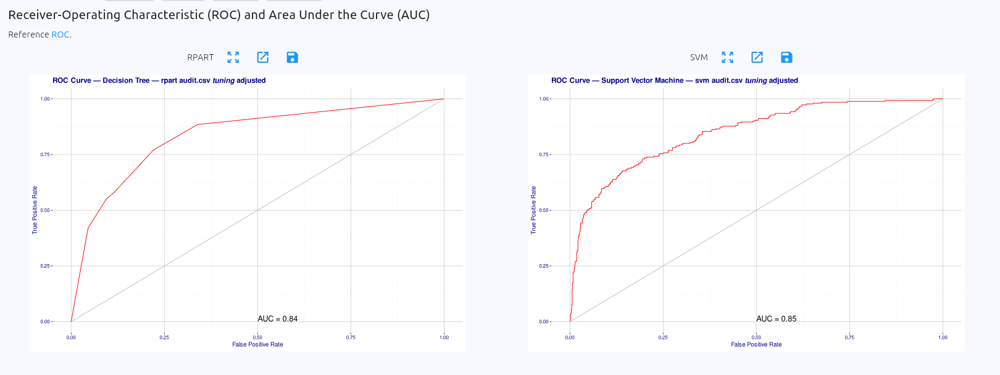

# 3. Practical Exercises: Support Vector Machines in Rattle
URLS:
  * Book: https://wattlecourses.anu.edu.au/mod/book/view.php?id=3353586&chapterid=535903
  * Lab: https://wattlecourses.anu.edu.au/mod/page/view.php?id=3353592
  * Solutions - https://wattlecourses.anu.edu.au/mod/page/view.php?id=3353593

## **Objectives**

The objectives of this lab are to experiment with the support vector machines (SVM) package available in R and Rattle, in order to better understand the issues involved with this data mining technique; to compare the SVM classification results with the results from decision trees; and to gain more experience with the different evaluation methods for supervised classification available in the Rattle tool.

---

## **Preliminaries**
Read through the following section in the Rattle online documentation:

- [**Support Vector Machine**](https://datamining.togaware.com/survivor/Support_Vector.html)
- [**Risk Chart**](https://www.togaware.com/datamining/survivor/Risk_Charts.html)

The support vector machine classifier in Rattle is based on the R package `kernlab` (Kernel Methods Lab), and specifically on the `ksvm` class from this package. You can get help on this class by typing the following two commands into the R console (the terminal window where you started R and Rattle), assuming you have started R:
```
    library(kernlab)
    help(ksvm)
```

To re-familiarise yourself with the evaluation of (classification) models, you might want to read the corresponding chapter [Evaluation and Deployment](http://datamining.togaware.com/survivor/Evaluation.html) in the Rattle Data Miner documentation (before coming to the lab).

---

## Feedback
* Got `besseldot` as the best performing SVM against training error
  ```R
  Support Vector Machine object of class "ksvm" 

  SV type: C-svc  (classification) 
  parameter : cost C = 1 

  Bessel kernel function. 
  Hyperparameter : sigma =  1 order =  1 degree =  1 

  Number of Support Vectors : 278 

  Objective Function Value : -191.7778 
  Training error : 0.123214 
  Probability model included. 
  ```

* For `besseldot`, we get the error matrix (which took a while)

```R
Error matrix for the SVM model [TUNING] (counts)

      Predicted
Actual  No Yes Error
   No  815  25   3.0
   Yes 146 114  56.2

Error matrix for the SVM model [TUNING] (proportions)

      Predicted
Actual   No  Yes Error
   No  74.1  2.3   3.0
   Yes 13.3 10.4  56.2

Overall Error = 15.55%; Average Error = 29.57%.

```

* Seriously, it takes goddamn ages to perform the Evaluation and get the error matrices. (For reference, with a linear SVM, the overall error was 16.55% but average 27.43%... uh.)

* In principle, the relationship between the training error and the validation (or tuning) error should be taken with caution. If the model has a really low training error, it follows that its validation error probably also sucks. On the other hand, a very high (say, near perfect) training error might be problematic if the model is overfit. So, clearly, the challenge is to balance the training error taken at the training stage and the overall error when evaluating the model. 

* Recall, my tweaked decision tree was (40, 13, 30, 0.02)

---
## Combined evaluation of Decision Tree and SVM side by side
```R
Error matrix for the RPART Decision Tree model [TUNING] (counts)


      Predicted
Actual  No Yes Error
   No  761  79   9.4
   Yes 117 143  45.0

Error matrix for the RPART Decision Tree model [TUNING] (proportions)


      Predicted
Actual   No  Yes Error
   No  69.2  7.2   9.4
   Yes 10.6 13.0  45.0

Overall Error = 17.82%; Average Error = 27.20%.


Error matrix for the SVM model [TUNING] (counts)

      Predicted
Actual  No Yes Error
   No  816  24   2.9
   Yes 146 114  56.2

Error matrix for the SVM model [TUNING] (proportions)

      Predicted
Actual   No  Yes Error
   No  74.2  2.2   2.9
   Yes 13.3 10.4  56.2

Overall Error = 15.45%; Average Error = 29.51%.

```

SVM is worse at identifying "Yes" cases, which make up much less of the dataset but perhaps we might be most interested in. That is, the decision tree has higher sensitivity. 



Based on the ROC curve, the SVM just marginally ekes out the Decision Tree by AUC (0.85 SVM, but 0.84 DT).

## Information about Risk Charts and what the lines mean
* In a risk chart, all tuples are sorted by their classification score(probability) and aligned along the caseload-axis from the highest score (0%) to the lowest score (100%).
* The green and blue line represents the recall and precision, respectively, when x% of sorted tuples(caseload) are classified as a positive class.
* The red line shows the proportion of risk taken into account, when x% of sorted tuples(caseload) are considered.

## End Note
If you have time, you might want to use different data sets, e.g from the [UCI Machine Learning repository](http://archive.ics.uci.edu/ml/), and explore how you can build SVMs and decision trees on them.