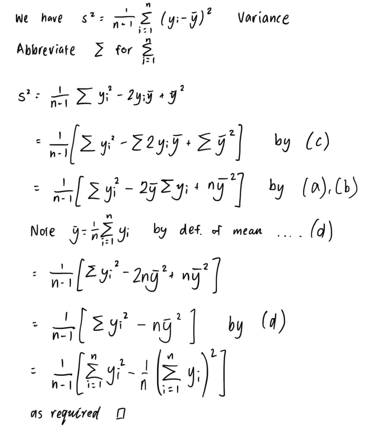

# S2013 <- Chapter 1: What Is Statistics?

## 1.1
- Population of interest, inferential objective, and how you might collect a sample
   
## 1.2
**Q1.2**: See `1-2.csv`
- a) See `1-2.R`
- b) Sure. If other wind readings were not made in comparable conditions to the top of a mountain, then we could say that the geography explains that outlier reading.
  - Fix: "Yes, it's windy". What a solution, thanks solution manual. 
- c) See `1-2.R`. About 24.44%
- d) No, I wouldn't say Chicago is unusually windy. The mean is 9.79 with stdev 4.14. Chicago's wind reading is similar to wind readings in other cities.

**Q1.6**: Introduces "modal category"
- a) 2 quarts of milk is the category purchased by the largest proportion of the 25 families at 0.36 frequency.
- b) 0.36 proportion of families purchased more than 2 quarts of milk.
- c) 1 - 0.04 - 0.08 = 0.88 proportion of families purchased 0 < x < 5 quarts of milk.

**Q1.7**: 
- a) The histogram looks like a mound except with a notable dip in the middle, which could be a bimodal distribution.
- b) Yes, the low count of observations within the "middle" of what would be a bell curve.
- c) The histogram depicts "self-reported heights". Two separate peaks could be explained by different height distributions based on sex.
  - Fix: Yes. Mention an assumption that the students are the same age. 

**Q1.8**: An article in Archaeometry presented an analysis of 26 samples of Romano–British pottery, found at four different kiln sites in the United Kingdom. The percentage of aluminum oxide in each of the 26 samples is given. See `1-8.csv`.
- a) See `1-8.R`
  - Fix: The answer has `xlim = c(10, 22)` and `ylim = c(0, 0.2)`. So with that view, it looks bimodal. 
- b) Somewhat bimodal, but with bigger bins, it has a positive skew and is not mound-shaped. Most of the data are distributed roughly within 15-20%, except for Llanederyn where the data is distributed roughly within 10-15%.
  - Fix: Both Llanederyn and Caldicot have lower sample values (I guess... Caldicot just has a bigger spread).

## 1.3
**Q1.9**:
- a) Within 1 sd, so 68%. 
- b) Within 2 sd, so 95%.
- c) 1 sd left and 2 sd right. So 68/2 + 95/2 = 81.5% 
- d) 100 - 99.7 = 0.3%
      - Fix: "Approximately zero". Thanks textbook.

**Q.10**: It has been projected that the average and standard deviation of the amount of time spent online using the Internet are, respectively, 14 and 17 hours per person per year (many do not use the Internet at all!).
- a) 14 - 17 = -3 hours, but that doesn't make sense, so it should be zero hours. 
- b) If the amount of time spent online using the internet is approximately normally distributed, 0% of users would be spending an amount of time less than the value "0". (I'm spitballing)
  - Fix: If you go by the empirical rule, 50 - 34 = 16% would lie below 1 standard deviation
- c) Note that 14 +- 17 is -3 and 31. "Per person, per year"?! It's not reasonable to have a negative measurement of "time spent on the Internet". The amount of time spent online using the internet could not be approximately normally distributed because attempting to apply the empirical rule based on this standard deviation measurement cannot be yielding reasonable distributions. It's more likely that the data is very negatively skewed with a large right tail.
    - Fix: Essentially, yes. "Since this doesn’t make sense, the population is not normal."

**Q1.11**: Math derivation question.
  - 

**Q1.12**: We have $n=6$ for $\set{1, 4, 2, 1, 3, 3}$. $\bar{y} = 7/3$. Then the result is $s^2 = 1/5 \times (40 - 6 * (7/3)^2) = 22/15 \approx 1.467$. Then $s \approx 1.21$.
- Correct.

**Q1.13**: I have never seen a textbook chain six questions like 1.11 to 1.16. That's cool, and annoying! Refer to **Q1.2**
  - a) For the data in Q1.2, $\bar{y} = 9.79$ and $s = 4.14$ 
    - Correct
  - b) For all intervals (1sd, 2sd, 3sd), 44 out of 45 measurements fall within them. The only measurement that is not included is the outlier, 35.1. The empirical rule would otherwise suggest that the distribution would be 68-95-99.7, but in this case, we have approximately all of the data within 1 sd, using the calculated sd. 
    - Fix: The answer manually calculates the expected frequency, being [30.600, 42.750, 44.865]

**Q1.14**: Skip

**Q1.15**: Refers to **Q1.4**
- a) $\bar{y} = 4.387$, $s = 1.871384$
- b) 
    | Intervals     | Actual_Frequency | Expected_Frequency |
    | :-------------- | :--------------- | :----------------- |
    | \[2.52, 6.26]  | 35               | 27.20              |
    | \[0.64, 8.13]  | 39               | 38.00              |
    | \[-1.23, 10.00] | 39               | 39.88              |
    - Correct

**Q1.16**: In this question we remove the extremely large value (11.88) and re-calculate Q1.15:
  - a) $\bar{y} = 4.19$, $s = 1.44$
  - b)
    | Intervals     | Actual_Frequency | Expected_Frequency |
    | :-------------- | :--------------- | :----------------- |
    | \[2.75, 5.64]  | 25               | 26.520             |
    | \[1.31, 7.08]  | 36               | 37.050             |
    | \[-0.13, 8.52] | 39               | 38.883             |
    - Correct

**Q1.17**: The empirical rule suggests that the standard deviation may be approximated by one-fourth of the range. 
- For Q1.4, we have $r =  5.38$, $r/4 = 1.345$, and $s = 1.441822$

**Q1.18**: We approximate $s = r/4 = 600/4 = 150$.

**Q1.19**: The empirical rule suggests that $r/4$ approximates tthe standard deviation for a set of measurements. However, taking the standard deviation from the chloroform at face value would suggest that, if normally distributed, half the results would lie from the interval -19 to 34, but negative values do not make sense as a measurement, and the range cannot have a minimum of -19. Therefore, chloroform amounts do not have a normal distribution. 

**Q1.20**: Weekly maintenance costs for a factory, recorded over a long period of time and adjusted for inflation, tend to have an approximately normal distribution with an average of $420 and a standard deviation of $30. If $450 is budgeted for next week, what is an approximate probability that this budgeted figure will be exceeded?
- Note that $450 = \bar{y} + s$. Then the approximate probability that this budgeted figure will be exceeded, according to the empirical rule, would be $50 - 34 = 16$%. 

**Q1.21**: The manufacturer of a new food additive for beef cattle claims that 80% of the animals fed a diet including this additive should have monthly weight gains in excess of 20 pounds. A large sample of measurements on weight gains for cattle fed this diet exhibits an approximately normal distribution with mean 22 pounds and standard deviation 2 pounds. Do you think the sample information contradicts the manufacturer’s claim? (Calculate the probability of a weight gain exceeding 20 pounds.)
- Note that $20 = \bar{y} - 2$. The relative probability of a weight gain exceeding 20 pounds is $50 + 34 = 84$%. The manufacturer claims that this probability is 80%. Therefore the claim is reasonable. 

## Supplementary Exercises
- Oh, I probably should've just done these rather than the above. Oh well. 